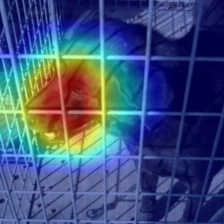
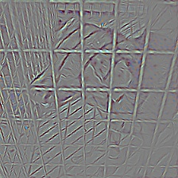
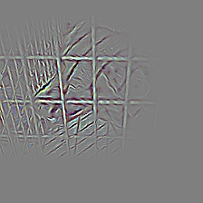
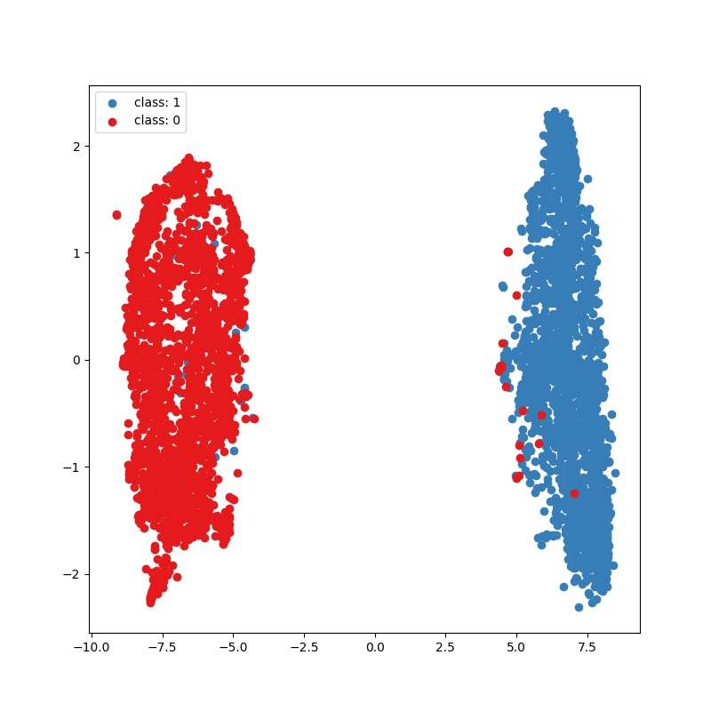

# IMAGE-CLASSIFICATION

This project provides a teaching demo code platform for image recognition, which also matians two visual tools, namely, CAM and T-SNE. We hope that any novice can implement his/her own deep learning framework through learning the sample but useful project, applying to subsequent specific tasks. As you get deeper into neural network, you'll see it is amazing and strong whiles confusing. Finally, good luck to us!

# Result
### CAM-VISUAL

Vsualizations of cam, gb, and cam+gb of a dog. The original cam tool is provided by [link](https://github.com/jacobgil/pytorch-grad-cam).

### T-SNE-VISUAL

This figure illustrates the feature distribution of dog and cat images, in which the feature dimension is reduced by t-sne alogrithm. 

### ACCURACY-TABLE

|   Base Model  | Pretrained  | ACC%(Top-1) |
|  ----  | :----:  | :----:  |  
| resnet50  | yes | 99.22 | 
| resnet50  | no | 60.78 | 

This table shows the val accuracy of trianed model based on resnet50 W\O pretrianed parameters.